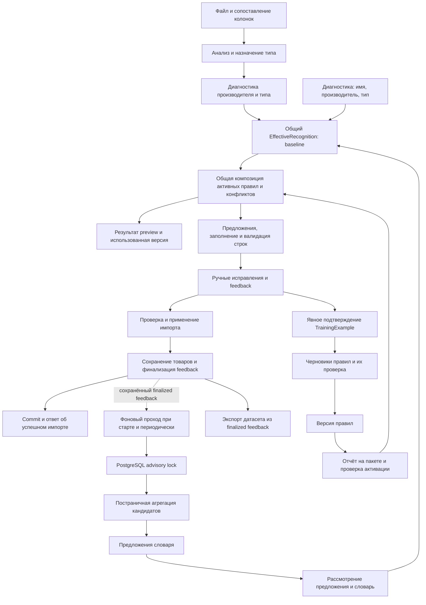

# Импорт, распознавание и обучение: карта и план упорядочивания

Дата аудита: 2026-09-20. Обновлено: 2026-09-22. Реализованы самостоятельная обработка знаний, единое распознавание и управление жизненным циклом подтверждённых примеров. Раздел «Этап 3» ниже уточняет текущую семантику; старые гипотезы аудита сохранены как история.

## Вывод

Накопление кандидатов и подготовка предложений словаря отделены от запроса импорта. Импорт и диагностическая страница используют общую композицию baseline + active rule sets и одинаковое разрешение конфликтов. Понятия «подтверждение», «обучение» и «проверка качества» по-прежнему имеют несколько реализаций; для подтверждённых примеров теперь определены отдельный отзыв и экспорт; глобальный запрет использования feedback остаётся отдельной будущей задачей. Модульный монолит, данные и политика обучения сохранены.

Первоначальный аудит был статическим. Для изменения жизненного цикла 2026-09-21 выполнены целевые тесты на изолированном PostgreSQL-контейнере с настоящими миграциями и регрессионные проверки импорта; результаты приведены ниже. Рабочая БД не использовалась, её объёмы не измерялись. Остальные риски аудита остаются гипотезами до отдельной проверки.

## 1. Существующий цикл

### Анализ и повторный анализ

`AnalyzeCatalogImportBatchCommandHandler` координирует разбор файла, сохранение ручных исправлений, назначение типа, shadow-проверки, обогащение, объяснения, удаление неподдерживаемых pending-feedback и замену результатов анализа.

Порядок существенен:

1. Загружаются сохраняемые строки, проверяется допустимость изменения области.
2. Результат чтения файла объединяется с сохранёнными строками через `CatalogImportReanalysisRows`.
3. Назначается тип товара, выполняются диагностические проверки производителя и типа.
4. `PrepareRunAsync` фиксирует состояние активных наборов правил.
5. Для однородного первого анализа вызывается enrichment; для смешанных типов или сохраняемых строк используется ветка обработки по типам. Все строки используют один `CatalogRecognitionRunContext`.
6. Enrichment возвращает рассчитанное effective-распознавание и исходные данные каждой строки. `CatalogImportRecognitionShadowService` сравнивает эти результаты с исходными значениями без повторного вызова движка. Объяснение строится из `effectiveAnalysis` и тех же evidence, включая активные правила; сохраняется `effectiveAnalysis`.
7. Pending-feedback сохраняемых строк удерживается, прочий удаляется; результаты заменяются через репозиторий.

Уже есть полезные защиты: сохранение ручных исправлений, ограничение смены области при повторном анализе, обработка конфликта конкурентного сохранения. Их необходимо сохранить.

### Единое распознавание импорта и диагностики

`ICatalogEffectiveRecognitionService` / `CatalogEffectiveRecognitionService` находится в `Recognition/Effective`. Композиция перенесена из enrichment: используется существующий `CatalogProductNameRecognitionService` для baseline и `CatalogRecognitionRuleSetRowExecutor` для активной версии. Проверки области и доступных определений, нормализация значений и объединение конфликтов сохранены. В частности, конфликт baseline не снимается активным совпадением; противоречие baseline и активной версии остаётся конфликтом; совпадающее значение сохраняет источник активной версии.

Запрос содержит имя, ManufacturerId/имя производителя для нормализации, ProductTypeId, допустимые определения характеристик и контекст запуска. Он не зависит от ImportRow, workbook или JSON. Результат содержит кандидатов, итоговые характеристики, конфликты, фактически прочитанные профили и состояние использованной активной версии. Сервис ничего не сохраняет.

Контекст создаётся один раз перед распознаванием анализа, включая все группы смешанного пакета. `CaptureForRunAsync` одним SQL-запросом фиксирует последние переключения всех областей и возвращает их в отдельный контекст. Содержимое конкретной версии читается лениво по зафиксированному VersionId и кешируется по паре ManufacturerId/ProductTypeId. Отсутствие активной версии тоже зафиксировано: активация между строками не применяется в текущем запуске. Новый контекст читает новое состояние. Контекст рассчитан на последовательную обработку; параллельная обработка строк в одном контексте не введена.

В том же контексте кешируются первое чтение профилей каждого типа и первое чтение approved-словаря. Preview показывает именно использованные профили, не выполняя отдельное чтение после распознавания. Это **не атомарный снимок всей БД**: разные типы впервые читаются в разное время, метаданные типа также читаются отдельно. Политика действует в пределах запуска, без новой таблицы запусков и исторического версионирования справочников. Прямые baseline-потребители сохраняют отдельный базовый сервис с кешированием на его scoped lifetime.

`CatalogImportRecognitionEnrichmentService` теперь вызывает общий сервис и отдельно применяет политику импорта: порог `0.9800`, допустимые источники, блокировку invalid Excel, сохранение ручных значений, предложения и ошибки/предупреждения. В `CatalogImportRowRecognition` сохраняются исходные данные до автозаполнения и рассчитанный результат. Shadow-статистика и `CatalogImportProductNameExplanationService` используют их в первом, повторном и смешанном анализе. Диагностика производителя и назначения типа остаётся отдельной. Панель характеристик подписана «Распознавание действующей конфигурацией».

`POST /api/catalog/recognition/preview` принимает прежние `productName`, `productTypeCode` и необязательный `manufacturerId`. Старые запросы допустимы. Query разрешает производителя и определения схемы и вызывает тот же effective-сервис. Ответ дополнен ManufacturerId/Name, HasCompleteScope, ActiveRuleSetVersionId и номером переключения. При полной области без активной версии возвращается baseline; при неполной области применяются доступные базовые правила/словарь, но область явно отмечается как неполная. Произвольный производитель не выбирается.

Ошибки загрузки/исполнения активной версии не заменяются успешным baseline: `recognition.active_rule_invalid` и `recognition.timeout` возвращают HTTP 422, `recognition.scope_mismatch` — 409, неизвестные производитель/тип — 404. ProblemDetails содержит `code` и понятный `detail`; страница показывает ошибку. Сбой инфраструктуры остаётся ошибкой HTTP, без скрытого fallback.

Пользовательский сценарий: открыть `/catalog/recognition`, выбрать производителя из справочника и тип, ввести имя, запустить проверку. Страница показывает те же кандидаты, значения и конфликты, которые использует импорт при той же конфигурации, выбранную область и использованный VersionId либо отсутствие активной версии. Применение значения к строке по-прежнему зависит от явных и ручных данных импорта. Без производителя или типа отображается предупреждение об ограниченной диагностике.

Проверки этапа единого распознавания (2026-09-21):

- `dotnet build backend/ElectronicService/src/ElectronicService.Web/ElectronicService.Web.csproj --no-restore`: успешно, без предупреждений и ошибок.
- `dotnet test backend/ElectronicService/tests/ElectronicService.CatalogImport.UnitTests/ElectronicService.CatalogImport.UnitTests.csproj --no-restore`: **32/32**. Включает совпадение preview/import, active-only правило, противоречие baseline/active, отсутствие версии/производителя, ошибки загрузки и исполнения/области, фиксацию версий между строками и типами, кеширование профилей/словаря и обновление следующего запуска, ручные значения, invalid Excel и объяснения.
- Целевой PostgreSQL-запуск `CatalogEffectiveRecognitionAnalysisTests|CatalogImportReanalysisPersistenceTests|CatalogRecognitionLearningTests`: **8/8**, отдельный контейнер с настоящими миграциями. Четыре новые проверки используют реальный handler, DI, репозитории, распознавание и сохранение: первый/повторный анализ × однородный/смешанный пакет. Подготовленный workbook и источник активных версий в этих четырёх проверках заменены тестовыми реализациями; это не end-to-end загрузка Excel через HTTP. Предыдущие проверки фонового обучения также прошли.
- Frontend: `npx tsc --noEmit`, `npm run build` и ESLint четырёх изменённых frontend-файлов — успешно. Интерактивный браузерный сценарий и отдельный HTTP end-to-end запуск в этом этапе не выполнялись.

Фоновое обучение, eligibility, TrainingExamples, экспорт, генерация черновиков и активация версий не изменялись; миграции не добавлялись. Следующий этап автоматически не выполнялся.

### Редактирование и применение

Одиночное и массовое редактирование вызывают `CatalogImportRecognitionFeedbackCollector`. Он классифицирует принятие, исправление, отклонение и ручное добавление; обновляет pending-feedback и происхождение значений. Он также содержит частную эвристику для `PRODUCT_SERIES`, то есть сбор подтверждений смешан с извлечением обучающей фразы.

`CatalogImportBatchApplier` в Serializable-транзакции подготавливает запись товаров и финализирует pending-feedback. `CatalogImportRecognitionFeedbackFinalizer` присваивает ему `Strong` и `IsTrainingEligible = true` после проверки роли применяющего пользователя.

После успешного commit `CatalogImportBatchApplier` сразу возвращает результат. Зависимости от aggregator/promoter и вызовы обработки знаний из запроса удалены; транзакция товаров, аудита, статуса пакета и финализации feedback сохранена.

### Самостоятельная обработка знаний

`CatalogRecognitionLearningHostedService` зарегистрирован в инфраструктуре. Первый проход запускается при старте приложения, следующий — после завершения предыдущего и паузы `PollInterval`. Нового импорта для обработки сохранённого feedback не требуется.

1. Проход получает `pg_try_advisory_lock` с ключом `0x4543524D4C454152`. Другой экземпляр API пропускает проход. Блокировка удерживается отдельным физическим соединением с `Pooling=false` и `Multiplexing=false`; его `await using` освобождает блокировку при завершении, исключении и отмене. Общей транзакции на очередь нет.
2. Для feedback фиксируется `cutoffUtc` начала прохода. Полностью обходятся Corrected, затем Accepted, затем Rejected. Каждая страница сортируется по `FinalizedAtUtc, Id`; курсор берётся с последней просмотренной записи, включая deferred. Offset не используется. Evidence исключает уже агрегированные записи.
3. После агрегации фиксируется максимальный `Id` accumulating candidates. Кандидаты обходятся по неизменяемому `Id` до этой границы, независимо от счётчиков и готовности. Новые кандидаты создаются с UUID v7. В отличие от `FirstSeenAtUtc`, `Id` не меняется при добавлении более ранних наблюдений.
4. Каждая страница aggregation/promotion получает новый DI scope и DbContext. Сохранение атомарно в пределах страницы. При ошибке проход прекращается, контекст уничтожается; следующий цикл заново читает долговечные входные данные. Продвижение курсоров хранится в памяти прохода. После перезапуска допустим повторный обход: уникальные CandidateKey/FeedbackId и проверки evidence сохранены.
5. Deferred не помечаются обработанными навсегда: новый полный проход проверяет их снова. Все запросы и циклы соблюдают CancellationToken остановки приложения.

Схема предложения требует реального `CreatedByUserId`. Автоматическое предложение сохраняет `Source=RecognitionLearning` и `GeneratedAutomatically=true`; автор берётся из самого раннего по `FinalizedAtUtc, Id` подтверждённого training-eligible Corrected feedback, связанного с кандидатом через evidence и существующим пользователем. Это происхождение подтверждения, а не пользователь последнего импорта. Если такого основания нет, кандидат остаётся deferred с диагностикой `missing_originating_reviewer`; остальные кандидаты продолжают обрабатываться.

Настройки секции `CatalogRecognitionLearning` в `appsettings.json`:

| Настройка | По умолчанию | Проверка при запуске |
|---|---|---|
| Enabled | true | При false сервис не запускает цикл |
| PollInterval | `00:00:30` | От `00:00:01` до `1.00:00:00` |
| BatchSize | 500 | От 1 до 5000 |

Логи различают начало, успешное завершение, пропуск занятой блокировки и ошибку прохода. Завершение содержит число просмотренных feedback/candidates, добавленных evidence/suggestions и deferred. При ошибке записываются исключение и счётчики уже завершённых страниц; успешное завершение не логируется. Отдельно сообщается отсутствие подтверждённого автора.

Проверено при выделении фонового обучения 2026-09-21 (до этапа единого распознавания):

- `ElectronicService.Web`: сборка без предупреждений и ошибок.
- `ElectronicService.CatalogImport.UnitTests`: 19/19, включая 14 существующих проверок ручных значений, конфликтов и повторного анализа, а также 5 проверок настроек обучения.
- Целевой запуск `CatalogRecognitionLearningTests` и `CatalogImportReanalysisPersistenceTests`: 4/4 на отдельном контейнере `postgres:18-alpine` с настоящими EF migrations. Проверены старт и перезапуск без нового импорта, >500 deferred в обеих очередях, несколько страниц Corrected, одинаковые временные метки feedback, повторная обработка без удвоения evidence/счётчиков, повторная проверка deferred, авторство и отсутствие автора, две конкурирующие копии сервиса, освобождение блокировки при отмене, сохранение импорта без learning и повтор после ошибки сохранения с новым контекстом.
- Для сборки существующего интеграционного проекта исправлены только два обращения к DTO алиаса (`alias.Value`). Restore тестовых зависимостей выполнен с локальным `-p:NuGetAudit=false`: штатный restore блокировался NU1903 у транзитивного SSH.NET 2025.1.0. Версии зависимостей и постоянные настройки аудита не менялись.

Ограничения: это полный повторный обход deferred, поэтому большой объём постоянно отложенных данных увеличивает длительность прохода; нагрузочный тест рабочей БД не выполнялся. Курсор не хранится между перезапусками, отдельная очередь/брокер/таблица метрик не добавлялись. Политика обучения, TrainingExamples, черновики и переключение версий не изменены.

### Два источника обучающих данных

| Путь | Вход и подтверждение | Потребитель |
|---|---|---|
| Накопление кандидатов | Finalized, training-eligible feedback; агрегация Accepted/Corrected/Rejected | Кандидаты, evidence, предложения словаря |
| Примеры для правил | Явное подтверждение сохранённой разметки, области, значения и фрагмента строки | TrainingExamples → literal/integer/multi-integer drafts → версии |
| Экспорт датасета | Finalized, training-eligible feedback до cutoff | DatasetReader и экспортёры; TrainingExamples не являются источником этого reader |

Подтверждение TrainingExample привязано к своему пакету и праву управления справочниками. Отзыв примера — отдельная операция. Чтение примеров для правил исключает отозванные записи, но экспорт feedback не соединяется с таблицей примеров и её статусом отзыва.

### Версии и метрики

Путь версий уже имеет существенные гарантии. Отчёт сохраняет версию правил, пакет, версию пакета, версию исполнителя, результаты строк и счётчики Proposed/Conflict/NoMatch/OutsideScope. Создание идёт в RepeatableRead. Переключение — в Serializable, с ожидаемым номером последовательности, явным подтверждением, причиной и проверкой отчёта.

Перед активацией повторно проверяются содержимое пакета, совпадение результатов, отсутствие конфликтов, наличие предложений и актуальность учебных оснований. Эти защиты нельзя заменить одним флагом `IsActive`.

Счётчики предложений и отсутствия совпадений описывают поведение правил, но сами по себе не являются точностью на независимой эталонной выборке. Проверка на учебных примерах также не заменяет такую оценку.

## 2. Подтверждённые различия и риски

| ID | Факт кода | Последствие / сценарий проверки | Приоритет |
|---|---|---|---|
| F1 | Исправлено: preview и import используют общий EffectiveRecognition | Совпадение кандидатов, значений и конфликтов проверено; объяснения используют результат enrichment | Закрыт в этапе единого распознавания |
| F2 | Исправлено: обработка общей очереди вынесена в hosted service | Импорт возвращается после commit; восстановление без нового импорта проверено на PostgreSQL | Закрыт в этом изменении |
| F3 | Исправлено: обе очереди обходятся по устойчивым курсорам до границы прохода | Более 500 deferred не скрывают готовые записи; повтор deferred и дедупликация проверены на PostgreSQL | Закрыт в этом изменении |
| F4 | TrainingSampleReader учитывает отзыв примера; DatasetReader читает finalized feedback независимо | Отзыв примера не означает исключение его source-feedback из экспорта. Нужно явно определить семантику отзыва для каждого потребителя | Высокий |
| F5 | Active version записывается внутри RecognizerKey; collector извлекает dictionary/profile, передаёт modelVersion: null | В цепочке feedback/export нет отдельного идентификатора активного rule set. Проверить, какие сведения о происхождении теряются; не подменять модель и набор правил одним понятием | Средний |
| F6 | Explanation получает исходный analysis и shadow; enrichment сохраняет иной результат, а shadow отсутствует в части веток | Возможное расхождение объяснения, диагностики и фактически применённых предложений. Нужна проверка первого и повторного анализа | Средний |
| F7 | Контекст фиксирует active states и кеширует первое чтение профилей по типу и approved-словаря | Повторное чтение источника с другим содержимым исключено и проверено; атомарный снимок всех таблиц не заявляется | Выполнено в границах этапа |
| F8 | Отзыв TrainingExample требует наличия исходного пакета, строки и связи feedback; cleanup удаляет просроченные редактируемые пакеты, FK feedback к пакету/строке — SetNull | После очистки путь отзыва через импорт может стать недоступен для сохраняющегося примера. Проверить на применённой схеме и предусмотреть независимое управление знаниями | Высокий |

Защита от повторов частично уже существует: уникальные CandidateKey и FeedbackId у evidence, уникальный активный TrainingExample по SourceFeedbackId. Это не доказывает отсутствие гонок, но утверждение «дедупликации нет» было бы неверным.

Конкурентные фоновые проходы и восстановление после ошибки aggregation проверены в этом изменении: второй экземпляр пропускает занятую блокировку, promotion после ошибки не запускается, следующая попытка использует новый контекст. Семантика удаления подтверждённых данных и отличие уверенности детерминированного правила `1.0000` от измеренного качества остаются предметом отдельной проверки.

## 3. Карта хранения и владельцев

Группы ниже соответствуют сущностям и конфигурациям EF, а не измерению текущей базы.

| Группа | Существующие сущности | Предлагаемый владелец | Решение на первый этап |
|---|---|---|---|
| Работа с файлом | ImportBatch, File, Column, Row | Импорт | Сохранить; описать срок жизни исходных строк |
| Результат деятельности | Products, Characteristics, AuditEntries | Каталог | Сохранить транзакцию применения |
| Наблюдения пользователя | RecognitionFeedback | Обратная связь | Определить значение статусов и правила пригодности |
| Подтверждённая разметка | RecognitionTrainingExample | Обучающие данные | Сохранить как отдельный вид подтверждения; независимый отзыв |
| Накопленные предложения | Candidate, CandidateEvidence, AssistantDictionarySuggestion | Подготовка знаний | Отделить запуск от HTTP-запроса применения |
| Действующие источники baseline | DictionaryTerm, RecognitionProfile | Распознавание / управление знаниями | Явно включить в состав конфигурации запуска |
| Черновики и основания | LiteralDraft + Evidence; IntegerDraft + Suffix + Evidence; MultiIntegerDraft + Part + Evidence | Подготовка правил | Пока сохранить типизированные таблицы |
| Выпуск правил | RuleSetVersion, RuleSetEntry, RuleSetSwitch | Управление версиями | Сохранить историю и проверки переключения |
| Оценка | RuleSetReport | Оценка качества | Отделить операционные счётчики от оценки по эталону |

Не объединять feedback, training example, candidate evidence и report в одну универсальную таблицу: они отвечают на разные вопросы. Возможность объединить черновики оценивать после унификации их жизненного цикла, с сопоставлением ограничений и запросов. Рост числа таблиц и рост объёма данных — разные проблемы; для второго нужны размеры, темпы роста и сроки хранения.

## 4. Предлагаемая архитектура

Оставить существующие слои .NET и одну БД. На первом этапе не вводить микросервисы, брокер или универсальный конструктор workflow.

1. **Импорт:** файл, mapping, рабочие строки, ручные исправления, проверка, применение. Вызывает распознавание и сохраняет обратную связь.
2. **Распознавание:** единый сценарий для импорта и диагностики. Получает контекст запуска, выдаёт кандидатов, конфликты, происхождение и объяснения. Политика автозаполнения остаётся явной и отдельной от поиска кандидатов.
3. **Обучающие данные:** наблюдения, подтверждения, отзыв, область применимости, источники. Не считает любое сохранение строки явным обучающим подтверждением.
4. **Подготовка знаний:** накопление кандидатов и генерация разных видов черновиков; общие правила повторного запуска, состояния и причины отклонения.
5. **Оценка и выпуск:** неизменяемая версия, фиксированный состав выборки, отчёт, решение о включении и история отката.

Целевой цикл: импорт → распознавание на фиксированной конфигурации → проверка человеком → сохранение данных и подтверждений → самостоятельная обработка знаний → оценка → явное включение версии → следующий запуск распознавания.

Единый цикл означает согласованные переходы и происхождение данных, а не один гигантский сервис и не одну таблицу.

Минимальные договорённости:

- Контекст распознавания: идентификатор запуска, режим baseline/effective/experimental, область manufacturer/product type, снимок или идентификаторы ревизий всех используемых источников, версия исполнителя.
- Происхождение результата: строка и её ревизия, источник, версия правил, фрагмент, нормализованное значение, причина конфликта/неприменения. Идентификаторы не извлекаются из текстового ключа как единственного источника истины.
- Обработка знаний: устойчивый идентификатор работы, граница выборки, прогресс, состояние, причина отсрочки/ошибки, повторный запуск. Отложенный элемент не блокирует продвижение очереди.
- Оценка: версия кандидата, состав и версия выборки, версия исполнителя, знаменатели метрик, отделение обучающих примеров от контрольных. Сохранять имеющиеся проверки stale-report и concurrency.
- Отзыв: различать отмену конкретного подтверждения, запрет использования наблюдения и вывод действующей версии. Не переписывать прошлые отчёты; обозначать изменившиеся основания.

## 5. Последовательность заданий реализатору

Каждый пункт — отдельная проверяемая работа. Не выполнять всю очередь одним изменением.

| Этап | Результат | Критерий готовности |
|---|---|---|
| 01. Зафиксировать поведение | Тесты F1–F4 и карта проверенных сценариев | Фактические результаты отделены от желаемого поведения; исходные тесты импорта проходят |
| 02. Общий путь распознавания — реализовано 2026-09-21 | EffectiveRecognition, контекст запуска, производитель и версия в preview, объяснения из результата enrichment | API/frontend собраны, целевые unit/integration проверки пройдены; ручные данные сохранены |
| 03. Самостоятельная обработка знаний — реализовано 2026-09-21 | Hosted service, курсоры, PostgreSQL advisory lock, scopes по страницам, авторство от feedback | Целевые проверки пройдены; следующие этапы автоматически не выполнялись |
| 04. Жизненный цикл подтверждений — реализовано 2026-09-22 | Свои примеры вне импорта, отзыв с причиной, ConfirmedExamples/ReviewedFeedback, отдельный экспорт подтверждений | Cleanup и отзыв проверены на PostgreSQL; исторический feedback и активные версии сохраняются |
| 05. Происхождение и оценка | Контекст запуска, связь результата с версиями, воспроизводимая выборка и понятные метрики | Можно восстановить, почему принято значение; повторная оценка одного снимка сравнима |
| 06. Упорядочить хранение и интерфейс | Каталог таблиц с владельцем/сроком жизни; согласованные экраны | Для каждого показателя понятны источник и период; удаление данных проверено; объединение таблиц только с доказанным выигрышем |

Этап 03 сначала должен выбрать самый простой надёжный механизм: существующий finalized-feedback может служить долговечным входом, если гарантированы справедливый обход и периодическое продолжение. Если нужен отдельный журнал заданий/outbox, обосновать одну таблицу и атомарную запись вместе с применением. Перенос в Task.Run без долговечного состояния не решает проблему.

Для каждого этапа: небольшой diff, целевые тесты, описание изменения поведения, обратимая миграция при необходимости. Старые столбцы/таблицы удалять отдельным этапом после сверки данных. Сохранять прошлые версии правил и отчёты. Откат поведения не должен требовать удаления новых пользовательских подтверждений.

## 6. Что ещё нужно выяснить

- Какие реальные конфликты наблюдает пользователь: расходятся значения, зависают операции, повторяются записи или непонятны показатели. Это поможет расставить приоритеты, но не блокирует этап 01.
- Реальные объёмы и рост таблиц, длительность анализа, размер очереди, частота ошибок; нужны агрегированные измерения, а не вывод из названий миграций.
- Должен ли экспорт для внешнего обучения использовать все reviewed-feedback или только явные подтверждения. До решения сохранить текущую семантику и сделать различие видимым.
- Должен ли отзыв влиять на уже активную версию сразу или требовать отдельного переключения. Историю и воспроизводимость сохранять в обоих случаях.
- Полное поведение очистки, внешних ключей и доступности отчётов на рабочей схеме БД.
- В `ml/catalog-name-recognition` обнаружен валидатор bundle. Это не подтверждает наличие запущенного внешнего ML-тренинга; его интеграцию следует инвентаризировать отдельно при наличии внешних процессов.

## 7. Опорные участки кода

Пути от корня репозитория; номера строк не фиксируются, чтобы документ переживал рефакторинг.

- `backend/ElectronicService/src/ElectronicService.Core/Catalog/ImportBatches/AnalyzeCatalogImportBatch/AnalyzeCatalogImportBatchCommandHandler.cs`
- `backend/ElectronicService/src/ElectronicService.Core/Catalog/ImportBatches/Analysis/CatalogImportRecognitionEnrichmentService.cs`
- `backend/ElectronicService/src/ElectronicService.Core/Catalog/ImportBatches/Analysis/CatalogImportRecognitionFeedbackCollector.cs`
- `backend/ElectronicService/src/ElectronicService.Core/Catalog/ImportBatches/Analysis/CatalogImportRecognitionFeedbackFinalizer.cs`
- `backend/ElectronicService/src/ElectronicService.Core/Catalog/Recognition/Preview/PreviewCatalogProductNameRecognitionQueryHandler.cs`
- `backend/ElectronicService/src/ElectronicService.Core/Catalog/Recognition/CatalogProductNameRecognitionService.cs`
- `backend/ElectronicService/src/ElectronicService.Core/Catalog/Recognition/Effective/CatalogEffectiveRecognitionService.cs`
- `backend/ElectronicService/src/ElectronicService.Core/Catalog/Recognition/Effective/CatalogRecognitionRunContext.cs`
- `backend/ElectronicService/src/ElectronicService.Core/Catalog/ImportBatches/Analysis/CatalogImportRowRecognition.cs`
- `backend/ElectronicService/src/ElectronicService.Core/Catalog/ImportBatches/Analysis/CatalogImportRecognitionShadowService.cs`
- `frontend/electronic-service-web/src/app/(dashboard)/catalog/recognition/page.tsx`
- `backend/ElectronicService/src/ElectronicService.Core/Catalog/Recognition/Learning/CatalogRecognitionCandidateAggregator.cs`
- `backend/ElectronicService/src/ElectronicService.Core/Catalog/Recognition/Learning/CatalogRecognitionCandidateSuggestionPromoter.cs`
- `backend/ElectronicService/src/ElectronicService.Core/Catalog/Recognition/ConfirmTrainingExample/ConfirmCatalogRecognitionTrainingExampleCommandHandler.cs`
- `backend/ElectronicService/src/ElectronicService.Core/Catalog/Recognition/RevokeTrainingExample/RevokeCatalogRecognitionTrainingExampleCommandHandler.cs`
- `backend/ElectronicService/src/ElectronicService.Core/Catalog/Recognition/Training/CatalogRecognitionRuleSetTrainingCheckService.cs`
- `backend/ElectronicService/src/ElectronicService.Infrastructure.Postgres/Catalog/ImportBatches/CatalogImportBatchApplier.cs`
- `backend/ElectronicService/src/ElectronicService.Infrastructure.Postgres/Catalog/ImportBatches/Cleanup/CatalogImportCleanupService.cs`
- `backend/ElectronicService/src/ElectronicService.Infrastructure.Postgres/Catalog/Repositories/CatalogRecognitionCandidateRepository.cs`
- `backend/ElectronicService/src/ElectronicService.Infrastructure.Postgres/Catalog/Repositories/CatalogRecognitionTrainingSampleReader.cs`
- `backend/ElectronicService/src/ElectronicService.Infrastructure.Postgres/Catalog/Repositories/CatalogRecognitionActiveRuleSetReader.cs`
- `backend/ElectronicService/src/ElectronicService.Infrastructure.Postgres/Catalog/Repositories/CatalogRecognitionRuleSetReportCreator.cs`
- `backend/ElectronicService/src/ElectronicService.Infrastructure.Postgres/Catalog/Repositories/CatalogRecognitionRuleSetActivationValidator.cs`
- `backend/ElectronicService/src/ElectronicService.Infrastructure.Postgres/Catalog/Repositories/CatalogRecognitionRuleSetSwitcher.cs`
- `backend/ElectronicService/src/ElectronicService.Infrastructure.Postgres/Catalog/Queries/CatalogRecognitionDatasetReader.cs`
- `backend/ElectronicService/src/ElectronicService.Infrastructure.Postgres/Data/ElectronicDbContext.cs`
- `backend/ElectronicService/src/ElectronicService.Infrastructure.Postgres/Catalog/Configurations/CatalogRecognitionFeedbackConfiguration.cs`
- `backend/ElectronicService/src/ElectronicService.Infrastructure.Postgres/Catalog/Configurations/CatalogRecognitionTrainingExampleConfiguration.cs`

Существующие проверки, которые следует использовать: `CatalogImportPipelineTests`, `CatalogImportReanalysisTests`, `CatalogImportReanalysisPersistenceTests`, `CatalogProductNameRecognitionServiceTests`. Наличие этих файлов не означает, что они были запущены в ходе аудита.

## Этап 3: жизненный цикл подтверждённых примеров (2026-09-22)

Реализован `ICatalogTrainingExampleManagement`: список, карточка, атомарный отзыв с причиной и экспорт сохранённых активных примеров. Управление и новый экспорт ограничены автором подтверждения и правом DictionariesManage; внутренние учебные выборки остаются общими для области. Существующий путь отзыва из импорта — совместимый адаптер. Старые отозванные записи сохраняют отсутствие причины; для новых запросов старого API без причины ставится явная техническая отметка legacy-api.

В `/catalog/recognition` добавлен раздел «Обучающие примеры» с серверной пагинацией и фильтрами, историей и новым JSONL-экспортом. Отзыв исключает конкретное подтверждение из последующих учебных выборок и нового экспорта. Он не отзывает отдельный reviewed-feedback, не переписывает скачанные файлы и не отключает активные версии. Новый формат confirmed-examples-v1 содержит первую строку метаданных и подтверждённые UTF-16 span; старый feedback/bundle-формат сохранён.

Риск F8 воспроизведён и исправлен: удаление пакета блокировалось промежуточным нарушением check constraint из-за порядка FK SET NULL. Миграция добавляет причину отзыва и BEFORE DELETE trigger пакета, отсоединяющий ссылки feedback на строки до удаления. Подтверждённые снимки и feedback сохраняются. К рабочей БД миграция не применялась.

F4 теперь является явно описанной разницей источников: отмена подтверждения фрагмента не равна запрету использования проверенной обратной связи. Глобальное исключение feedback и пересчёт его производных не входят в этот этап. Исторические записи аудита выше не следует читать как отсутствие новой функции.

Проверки: 32 unit-теста импорта/распознавания пройдены; 8 существующих интеграционных сценариев предыдущих этапов пройдены; 4 новых интеграционных теста жизненного цикла пройдены после исправлений. Новые проверки охватывают cleanup с реальной схемой, JSONL и Unicode, отзыв/повторное подтверждение, неизменность старого feedback-экспорта, чужой/заблокированный пользователь и отсутствие права, конкурентный отзыв, повторную проверку literal/integer/multi-integer оснований. Запуски выполнялись отдельно и в составе общего фильтра; число тестов не означает число проверяемых утверждений.

API собран без предупреждений и ошибок. Frontend build, TypeScript и ESLint пройдены. Браузерный E2E не выполнялся. Restore интеграционного проекта выполнен с локальным -p:NuGetAudit=false из-за существующего NU1903 SSH.NET; постоянные настройки не менялись.

Подробности API, формата, миграции и ограничений: [training-lifecycle-implementation.md](training-lifecycle-implementation.md). Следующие этапы — происхождение/оценка качества и упорядочение хранения — автоматически не выполнялись.

## Этап 4 — происхождение и исключение источника (22.09.2026)

Добавлен `LearningProvenanceService`: Feedback → CandidateEvidence → Candidate → Suggestion → DictionaryTerm; Feedback → TrainingExamples → evidence трёх видов черновиков → RuleSetEntries → версии → история переключений. Только реальные сохранённые связи, серверная пагинация, минимум сведений о чужих подтверждениях.

Отзыв подтверждения по-прежнему отменяет только TrainingExample. Исключение источника — отдельное необратимое через API решение с автором, временем и причиной на Feedback. Оно запрещает новые учебные выборки и подтверждения, пересчитывает актуальный вклад в кандидатов; допускаются нулевые счётчики. История и исходный IsTrainingEligible сохранены. Pending suggestion требует актуального EvidenceRevision и достаточных оснований для одобрения.

Выпущенные словарные термины и действующие версии автоматически не отключаются. В происхождении показано «Основания изменились — требуется пересмотр». Действующая версия определяется последним переключением области; исправление словаря либо проверка/переключение правил требуют отдельного решения.

Общий advisory gate защищает исключение, агрегацию, promotion, одобрение, подтверждение, сохранение черновиков и активацию. Исключение и пересчёт атомарны; gate получают до транзакции и чтения изменяемого состояния. Экспорты сохраняют право закончить ранее начатый снимок. Рабочая БД не изменялась.

Подробности API, блокировок, миграции и проверок: [learning-provenance-implementation.md](learning-provenance-implementation.md).

## Этап 5 — сравнительная оценка и выпуск правил (23.09.2026)

Существующий RuleSetReport расширен неизменяемым JSON-снимком сравнения baseline + текущая версия с тем же baseline + кандидат. Обе стороны используют общий effective recognizer. Сохраняются конфигурации, собственная разметка пользователя, политика, результаты и знаменатели; исторический повтор не читает живые зависимости распознавания.

Контроль отделён от известных учебных имён по evidence всех трёх видов. Дубли не увеличивают знаменатель, противоречия блокируют выпуск. В существующей панели подтверждений добавлено назначение «только контроль правил»: такие примеры не входят в подготовку черновиков и confirmed-export. Это не запрещает отдельное фоновое обучение словаря на Feedback и не доказывает полную независимость от baseline.

Новая активация через прежний RuleSetSwitcher требует актуального сравнительного отчёта, улучшения без регрессий и всех прежних проверок пакета/учебных оснований. Старые отчёты доступны для чтения, но не подходят для новой активации. Отключение до baseline сохранено. В интерфейсе добавлены метрики, различия, причины запрета, повтор снимка и открытие исторического отчёта по номеру после cleanup.

Миграция добавляет evaluation_json, is_evaluation_only и BEFORE STATEMENT SQL-триггеры общего gate для изменяемых зависимостей. Gate использует соединение DbContext; ранее описанное отдельное соединение этапа 4 заменено. Порядок переключения: gate → Serializable → свежая проверка → Switch/commit → освобождение. Это сериализует запись затронутых таблиц между областями; обновление старых и новых экземпляров должно быть согласованным.

Рабочая БД не использовалась; миграция к ней не применялась. Политика, ограничения, проверки и порядок развёртывания: [learning-evaluation-release-implementation.md](learning-evaluation-release-implementation.md). Остаются отдельный выпуск словарных предложений, внешняя независимая оценка качества и сроки хранения.

## Этап 6 — оценка и выпуск словарных предложений (23.09.2026)

Ветка RecognitionLearning → Candidate → Suggestion → DictionaryTerm теперь проходит общий сравнительный evaluator и политику допуска. Перед одобрением фиксируется окончательное решение; оценивается один дополнительный термин поверх того же baseline и действующих правил. Требуются собственный актуальный отчёт, достаточные основания и явное подтверждение. Старый endpoint без отчёта для учебного предложения больше не разрешает выпуск.

RuleSetReport сохраняет обязательные пакет и версию. Словарные снимки помещены в специализированное хранение без фиктивных доменных связей, при общем вычислении, метриках и UI. Одобрение сохраняет ссылку на использованный отчёт; просмотр и исторический повтор доступны автору после cleanup. Старые rule-снимки сохраняют формат и отпечатки.

Контроль исключает известные имена оснований кандидата и всех трёх видов evidence активных правил. IsEvaluationOnly остаётся резервированием для контроля правил, а не глобальным запретом обучения Feedback. Историческая независимость baseline не гарантируется.

Одобрение/отклонение выполняются под gate в свежей Serializable-транзакции. Добавлены триггеры того же gate на suggestions, candidates и candidate_evidence. Права проверяются с overrides. Термин, решение, кандидат и связь отчёта сохраняются атомарно; изменение словаря устаревает ранее выданные допуски правил.

Рабочая БД не использовалась. Миграция не применялась к ней; учитывать автоматический MigrateAsync при запуске API. Подробности, проверки и развёртывание: [dictionary-evaluation-release-implementation.md](dictionary-evaluation-release-implementation.md). Прямое администрирование словаря и ручные предложения других источников остаются отдельными путями. Общий экран цикла добавлен в этапе 7 ниже; сроки хранения ещё не реализованы.

## Этап 7 — рабочее пространство обучения (24.09.2026)

Из распознавания доступно единое рабочее пространство выбранного производителя и типа: обзор, собственные примеры, правила, словарь, собственные отчёты и действующая конфигурация. Область, вкладка, выбранный объект и пакет сохраняются в URL; переход в импорт сохраняет возврат. Правила и словарь остаются независимыми ветками с прежними проверками выпуска, без общего флага готовности.

Экран переиспользует генерацию и сохранение всех трёх видов черновиков, явное создание версии, сравнительную оценку, активацию, одобрение словарных предложений и происхождение. Генерация доступна без пакета; для оценки правил выбирается собственный пакет. Исторические отчёты доступны после cleanup. Отклонение словарного предложения не требует достаточных оснований.

Добавлен read-only API с серверной пагинацией по 20 объектов, проверкой эффективного DManage, области и владения. Собственные подтверждения и отчёты отделены от общих знаний; GET обзора не запускает обучение, генерацию или оценку. Ошибки операций обновляют отображаемое состояние; устаревшие ответы другой области не подменяют текущую.

Новых таблиц, миграций и фоновых процессов нет. Рабочая БД не использовалась. Пройдено 40 unit и 75 интеграционных проверок, основные пути правил и словаря проверены в браузере на временной БД. Детали и ограничения: [learning-workspace-implementation.md](learning-workspace-implementation.md). Следующий отдельный этап — правила хранения и очистки накопленной истории; промышленная нагрузка и внешняя независимая оценка качества этим этапом не проверены.
